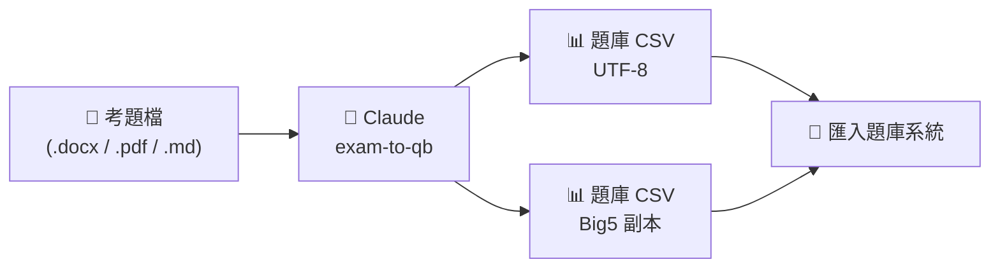

# QB 題庫轉換

## 這個專案在做什麼？（3 秒看懂）

> **把「老師手上的考題檔」變成「系統吃得下的題庫檔」。**

```
   📄 考題檔                 🤖 交給 Claude                📊 題庫 CSV
  Word / PDF / md   ──▶  「請把 xxx 轉成題庫」  ──▶   直接匯入題庫系統
```



### 你只要做三件事
| 步驟 | 動作 | 例子 |
|:--:|------|------|
| 1️⃣ | 把考題檔放進 `題庫/` | `題庫/exam02.docx` |
| 2️⃣ | 跟 Claude 說一句話 | `請把 題庫/exam02.docx 轉成題庫` |
| 3️⃣ | 拿走產生的 CSV 匯入系統 | `題庫/exam02.csv` |

### 它會幫你處理的雜事
- ✅ 認出題型（是非 / 單選 / 複選 / 填充 / 問答）
- ✅ 拆好題目、選項、答案、解說
- ✅ 排成題庫系統要的 27 欄格式
- ✅ 編碼一律 UTF-8（另附 Big5 版給舊系統）
- ✅ 可依章節標題填「類別」

### 目前已完成的題庫
| 題庫 | 題數 | 位置 |
|------|:--:|------|
| 資訊圖表（範例） | 12 | `題庫/exam01.csv` |
| AI 基礎概論 第 1 章 | 20 | `題庫/AI_chap1.csv` |
| 低碳生活與氣候公約 | 30 | `題庫/低碳生活與氣候公約測驗.csv` |

---

# 詳細使用說明

把使用者提供的題目檔案（Word / PDF / 純文字等）轉成可匯入的題庫 CSV，並可同時輸出 Big5 副本。
背後由 `exam-to-qb` skill 自動處理（位置：`~/.claude/skills/exam-to-qb/`）。

## 編碼約定
- 主檔一律 **UTF-8 (no BOM)**。
- Big5 副本命名規則：副檔名前加 `_big5`，例如 `exam02.csv` → `exam02_big5.csv`。
- Big5 字集較小，轉換時會自動把 `≥`→`≧`、`≤`→`≦`；若仍有無法表示的字元會以 `?` 寫入並提出警告。

## 如何下 prompt

### 1. 轉換新題目檔（最常用）
```
請把 exam02.docx 轉成題庫 exam02.csv
```
會自動詢問：①是否填入「類別」欄、②是否要 Big5 副本。
也可用斜線指令：
```
/exam-to-qb exam02.docx
```

### 2. 一次把條件講清楚（省去被反問）
```
請把 exam02.docx 轉成題庫 exam02.csv，類別填「綠色能源」，並一併產生 Big5 版 exam02_big5.csv
```
```
把 exam03.pdf 轉成題庫，不需要類別，也不用 Big5
```

### 3. 只要 Big5 副本 / 補轉舊檔
```
請把 exam01.csv 另存一份 Big5 格式
```

### 4. 修訂已轉好的題庫
```
請修訂 exam02.csv，把類別欄改成「資訊安全」
```
```
exam02.csv 第 5 題答案改成 (C)，並更新解說
```

### 5. 其他加工（CSV 完成後再要求）
```
把 exam02.csv 也輸出成 Excel (.xlsx)
```
```
把 exam02_big5.csv 轉回 UTF-8
```

## 下 prompt 小訣竅
- 講明**來源檔名與輸出檔名**（如 `exam02.docx → exam02.csv`），不必猜。
- **先決定的事先講**（類別名稱、要不要 Big5），可省去中途反問。
- 沒指定時預設：UTF-8 (no BOM)，並主動詢問類別與 Big5。
- 支援來源格式：`.docx`、`.pdf`、`.txt`、`.md`、`.csv`（舊版 `.doc` 二進位檔建議先另存成 `.docx`）。

## 題庫 CSV 格式速查（27 欄）
| 欄 | 名稱 | 說明 |
|----|------|------|
| 1 | 題組 | 留空（題庫不支援） |
| 2 | 類別 | 可選；匯入線上測驗時不支援，僅題庫內分類 |
| 3 | 題型 | 1=是非 2=單選 3=複選 4=填充 5=問答 |
| 4 | 題目 | 題幹；填充題把答案內嵌成 `[*答案*]` |
| 5 | 答案 | 是非:1=是/2=否；單選:選項編號；複選:`1,2,4`；填充:留空；問答:參考答案 |
| 6 | 解說 | 可空 |
| 7 | 難易度 | 1=容易 2=適中 3=困難 |
| 8 | 選項1 | 選擇題=選項文字；填充題=1不分大小寫/2區分大小寫 |
| 9 | 選項2 | 選擇題=選項文字；填充題=1不考慮順序/2需考慮順序 |
| 10–27 | 選項3–20 | 其餘選項 |

## 目錄結構
```
QB/
├── README.md                 本說明
├── exam.csv                  題庫範本（UTF-8 no BOM）
├── exam_big5.csv             範本 Big5 版
└── 題庫/                     已完成的題庫、原始題目檔與中繼檔
                              （只有 exam* 開頭的範例檔入庫，其餘科目題庫僅保留本機，見 .gitignore）
```

## 題庫/ 目前檔案
| 檔案 | 編碼 | 說明 |
|------|------|------|
| `exam.docx` | — | exam01 原始題目檔 |
| `exam_text.txt` / `rows.tsv` | UTF-8 | exam01 抽取文字與 TSV 中繼檔 |
| `exam01.csv` | UTF-8 (no BOM) | 範例題庫（資訊圖表，12 題，類別=綠色能源） |
| `exam01_big5.csv` | Big5 | 範例題庫 Big5 版 |
| `AI 基礎概論測驗.md` | UTF-8 | AI_chap1 原始題目檔（本機） |
| `AI_chap1.csv` | UTF-8 (no BOM) | AI 基礎概論 第 1 章（20 題單選，類別=1-1～1-4 各節標題）（本機） |
| `AI_chap1_big5.csv` | Big5 | AI_chap1 Big5 版（本機） |
| `低碳生活與氣候公約測驗.docx` | — | 低碳生活與氣候公約測驗 原始題目檔（本機） |
| `低碳生活與氣候公約測驗.csv` | UTF-8 (no BOM) | 低碳生活與氣候公約（30 題單選，類別=1.1 / 1.2 各節標題）（本機） |
| `低碳生活與氣候公約測驗_big5.csv` | Big5 | 低碳生活與氣候公約測驗 Big5 版（本機） |

新轉換的題庫請一律輸出到 `題庫/`，例如：`請把 題庫/exam02.docx 轉成題庫 題庫/exam02.csv`。
